<div align="center">

# Petshop Jinx - Flutter E-Commerce App

**Aplikasi mobile e-commerce petshop siap pakai, dibangun dengan Flutter & Firebase**

*Aplikasi belanja hewan peliharaan open-source dengan keranjang, wishlist, checkout, lacak pesanan, notifikasi & lebih*

*Clean Architecture | Riverpod | Firestore | Material Design 3*

[](https://flutter.dev)
[](https://dart.dev)
[](https://firebase.google.com)
[](https://riverpod.dev)
[]()
[]()

[](assets/apk/petshop-jinx-v1.0.0.apk)

</div>

---

## Overview

Petshop Jinx adalah aplikasi e-commerce petshop untuk Android, iOS, dan Web. Menyediakan pengalaman belanja online lengkap mulai dari menjelajahi produk, pencarian, keranjang belanja, wishlist, checkout dengan metode cash on delivery, pelacakan pesanan secara real-time, hingga notifikasi push. Dibangun dengan clean architecture dan didukung Firebase untuk autentikasi, database, dan penyimpanan.

---

## Screenshots

<div align="center">
<table>
  <tr>
    <td align="center">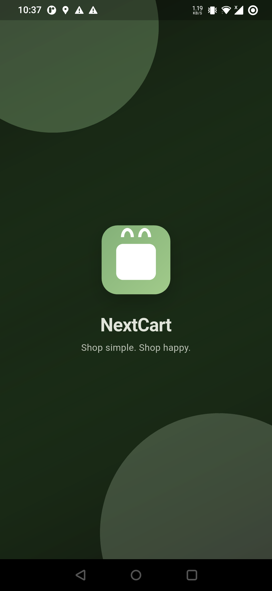<br/><b>Splash</b></td>
    <td align="center">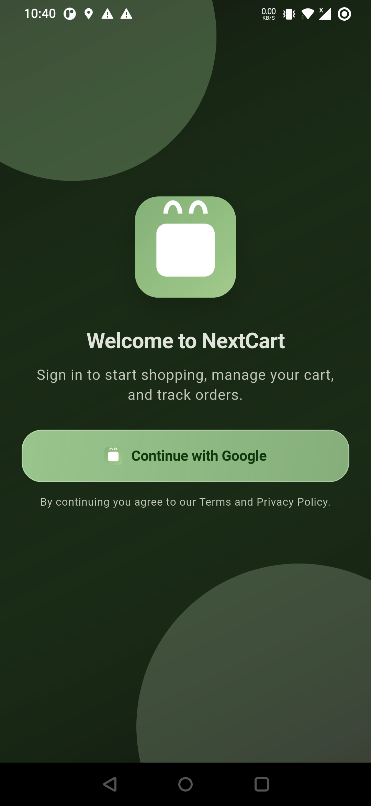<br/><b>Login</b></td>
    <td align="center">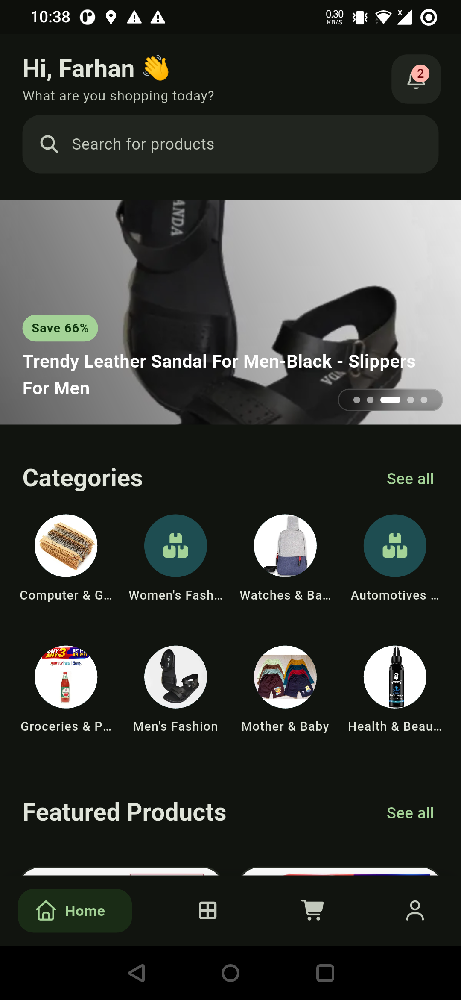<br/><b>Home</b></td>
    <td align="center">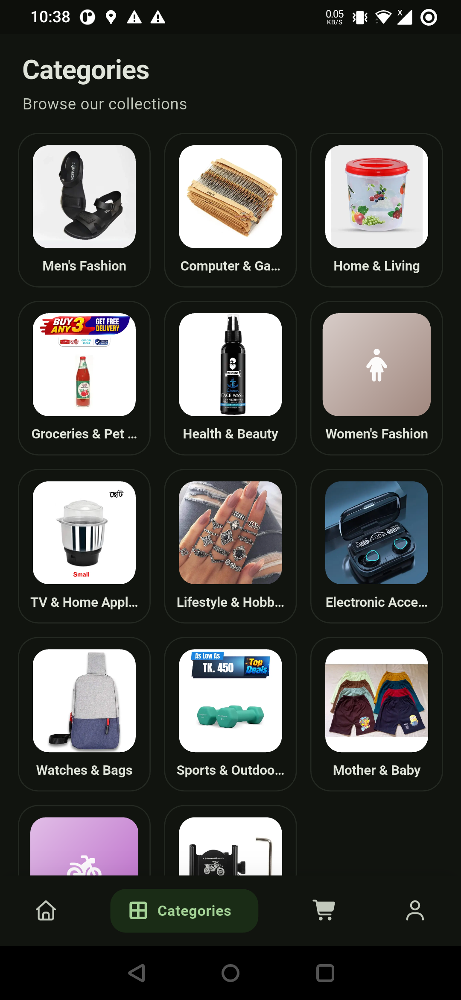<br/><b>Kategori</b></td>
  </tr>
  <tr>
    <td align="center">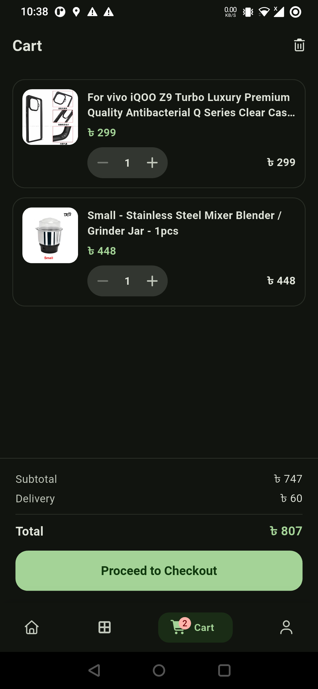<br/><b>Keranjang</b></td>
    <td align="center">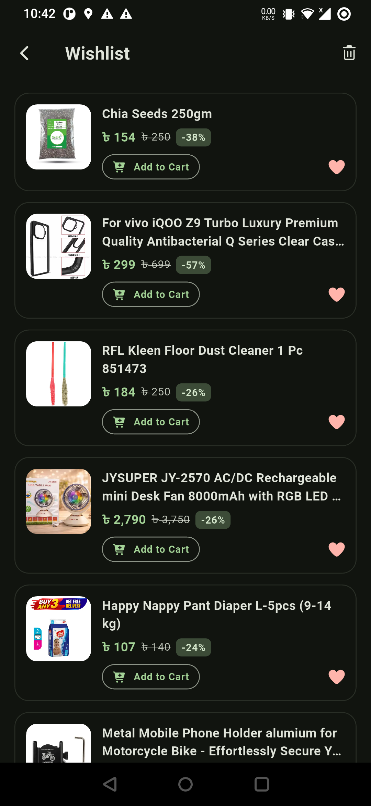<br/><b>Wishlist</b></td>
    <td align="center">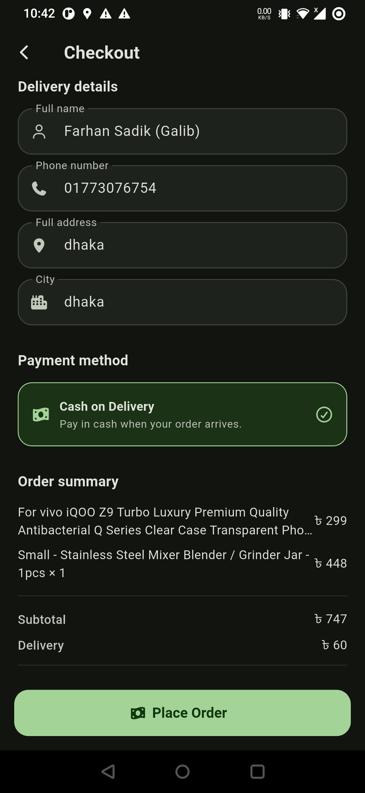<br/><b>Checkout</b></td>
    <td align="center">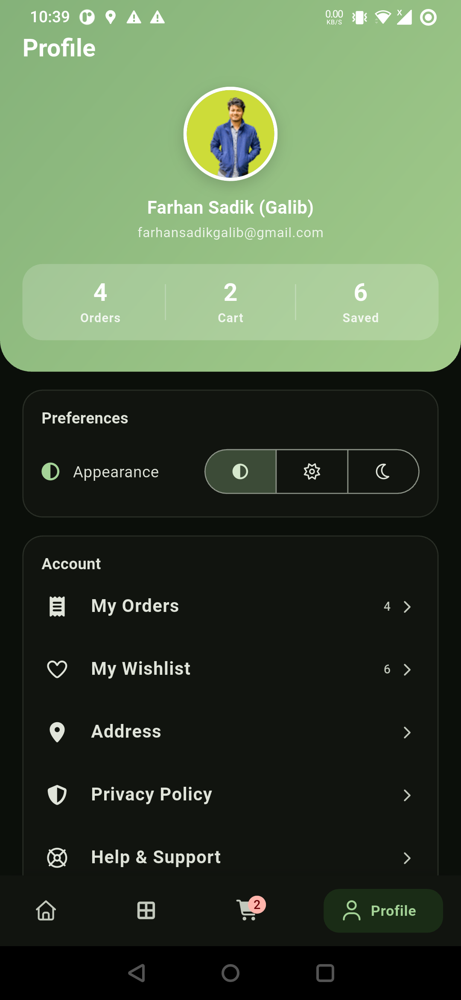<br/><b>Profil</b></td>
  </tr>
  <tr>
    <td align="center">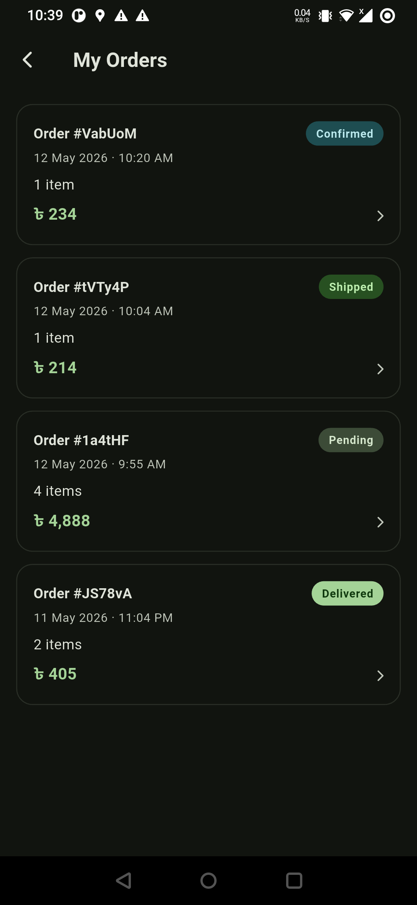<br/><b>Pesanan</b></td>
    <td align="center">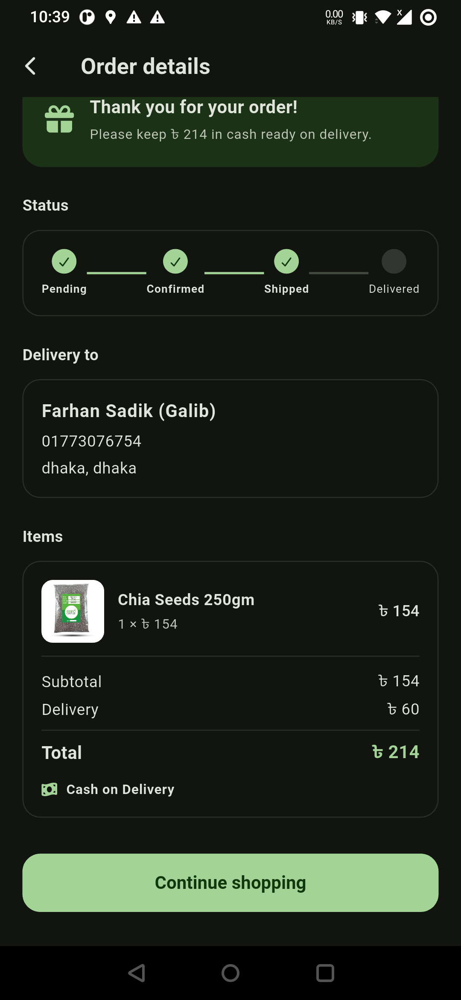<br/><b>Detail Pesanan</b></td>
    <td align="center">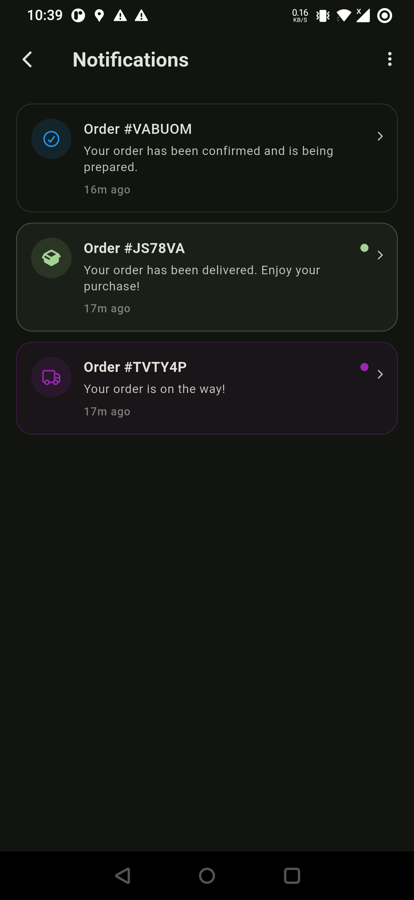<br/><b>Notifikasi</b></td>
    <td></td>
  </tr>
</table>
</div>

---

## Tech Stack

- **Flutter** (Dart 3.8+) — cross-platform (Android, iOS, Web)
- **Firebase** — Auth, Firestore, Cloud Storage, Cloud Messaging
- **Riverpod** — state management (dengan code generation)
- **GoRouter** — declarative routing dengan auth guards (StatefulShellRoute)
- **Freezed** — immutable data models
- **Dio** — HTTP networking
- **GNav** — modern bottom navigation bar
- **Local Notifications** — push notification untuk update status pesanan
- **Material Design 3** — UI bertema hijau dengan responsive layout (ScreenUtil)

## Fitur

- Google Sign-In & Firebase Authentication
- Katalog produk dengan filter kategori
- Pencarian produk full-text
- Keranjang belanja (tambah, hapus, ubah jumlah)
- Wishlist (simpan produk favorit)
- Checkout dengan detail pengiriman & cash on delivery
- Riwayat pesanan dengan pelacakan status real-time (pending, dikonfirmasi, dikirim, diterima)
- Notifikasi push saat status pesanan berubah
- Pusat notifikasi in-app dengan badge belum dibaca
- Profil pengguna & manajemen alamat pengiriman
- Mode gelap / terang / mengikuti sistem
- Alur onboarding untuk pengguna baru
- UI responsif untuk Android, iOS & Web

## Struktur Proyek

```
lib/
├── app/                # Router, routes, navigation shell
├── core/               # DI providers, theme, storage, utils, shared widgets
├── features/           # Modul fitur (Clean Architecture)
│   ├── auth/           #   Autentikasi
│   ├── home/           #   Halaman utama
│   ├── categories/     #   Kategori produk
│   ├── products/       #   Daftar produk
│   ├── product_detail/ #   Detail produk
│   ├── cart/           #   Keranjang belanja
│   ├── checkout/       #   Proses checkout
│   ├── orders/         #   Manajemen pesanan
│   ├── notifications/  #   Notifikasi push & in-app
│   ├── wishlist/       #   Wishlist
│   ├── profile/        #   Profil pengguna
│   └── search/         #   Pencarian produk
└── shared/             # Widget bersama seluruh aplikasi
```

Setiap fitur mengikuti pemisahan layer **data / domain / presentation**.

## Memulai

### Prasyarat

- Flutter SDK (stable channel)
- Dart 3.8+
- Android Studio / Xcode (untuk emulator)
- Proyek Firebase (lihat [dokumentasi setup Firebase](https://firebase.google.com/docs/flutter/setup))

### Setup

```bash
# Clone repo
git clone https://github.com/igincantek/MOBIKEIGIN.git
cd MOBIKEIGIN

# Install dependensi
flutter pub get

# Jalankan code generation (Freezed, Riverpod, JSON serialization)
dart run build_runner build --delete-conflicting-outputs

# Jalankan aplikasi
flutter run
```

### Perintah Berguna

```bash
# Mode watch untuk code generation (otomatis re-run saat file berubah)
dart run build_runner watch --delete-conflicting-outputs

# Jalankan linter
flutter analyze

# Jalankan test
flutter test

# Build release APK
flutter build apk

# Build untuk iOS
flutter build ios

# Build untuk web
flutter build web
```

## Setup Firebase

Aplikasi menggunakan layanan Firebase berikut:

| Layanan | Kegunaan |
|---------|---------|
| Firebase Auth | Autentikasi pengguna (email, Google Sign-In) |
| Cloud Firestore | Katalog produk, pesanan, keranjang, notifikasi, data pengguna |
| Cloud Storage | Gambar produk dan aset |
| Cloud Messaging | Izin notifikasi push dan manajemen token |

Aturan keamanan Firestore mengizinkan pembacaan publik untuk produk/kategori dan penulisan terbatas per pengguna untuk keranjang, pesanan, dan notifikasi. Lihat [firestore.rules](firestore.rules) dan [storage.rules](storage.rules).

### Notifikasi

Ketika status pesanan berubah di Firestore, aplikasi akan:
1. Mendeteksi perubahan melalui listener stream pesanan real-time
2. Menulis dokumen notifikasi ke `users/{uid}/notifications/`
3. Menampilkan notifikasi push lokal di perangkat
4. Mengetuk notifikasi akan membuka halaman detail pesanan

## Arsitektur

Aplikasi mengikuti **Clean Architecture** dengan tiga layer per fitur:

1. **Data** — implementasi repository (Firebase, API calls)
2. **Domain** — model (kelas Freezed), antarmuka repository
3. **Presentation** — widget UI, ViewModel (Riverpod providers)

Dependency injection ditangani via Riverpod providers di `core/di/`.

## Lisensi

Proyek ini bersifat privat dan tidak dilisensikan untuk redistribusi.

---

<div align="center">

**Dibuat oleh Made Igin · Dibangun dengan Flutter & Firebase**

`petshop` `flutter-ecommerce` `flutter-shopping-app` `shopping-cart` `online-store` `flutter-app` `flutter` `dart` `firebase` `firestore` `riverpod` `clean-architecture` `material-design-3` `go-router` `freezed` `push-notifications` `wishlist` `order-tracking` `google-sign-in` `cross-platform`

</div>
